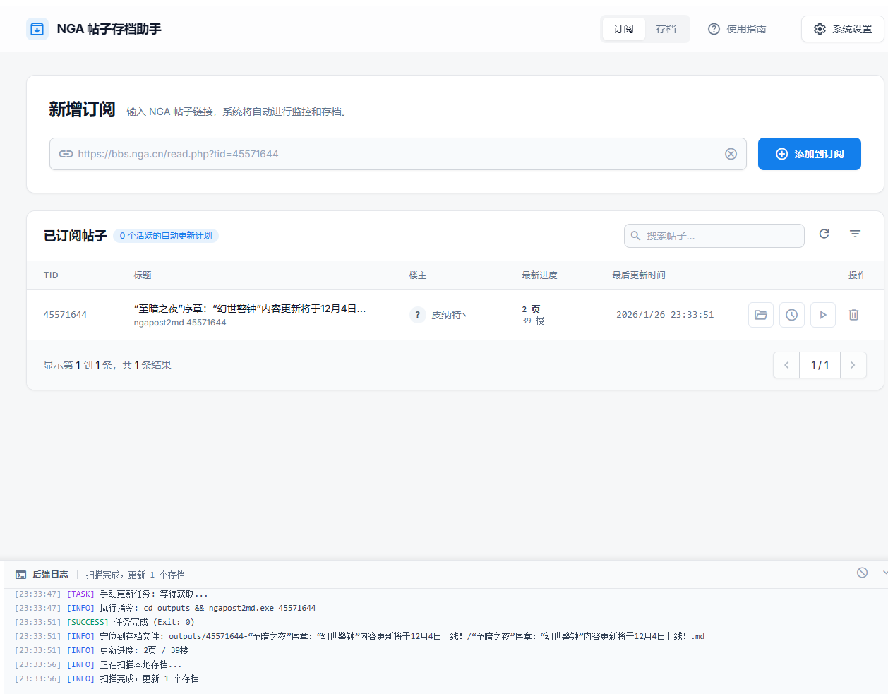
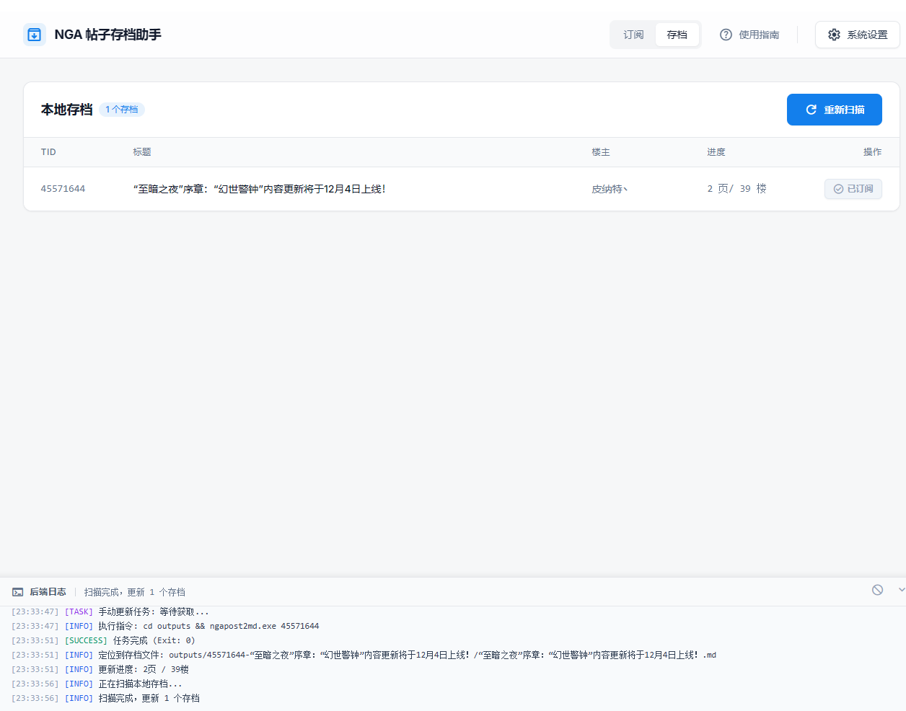
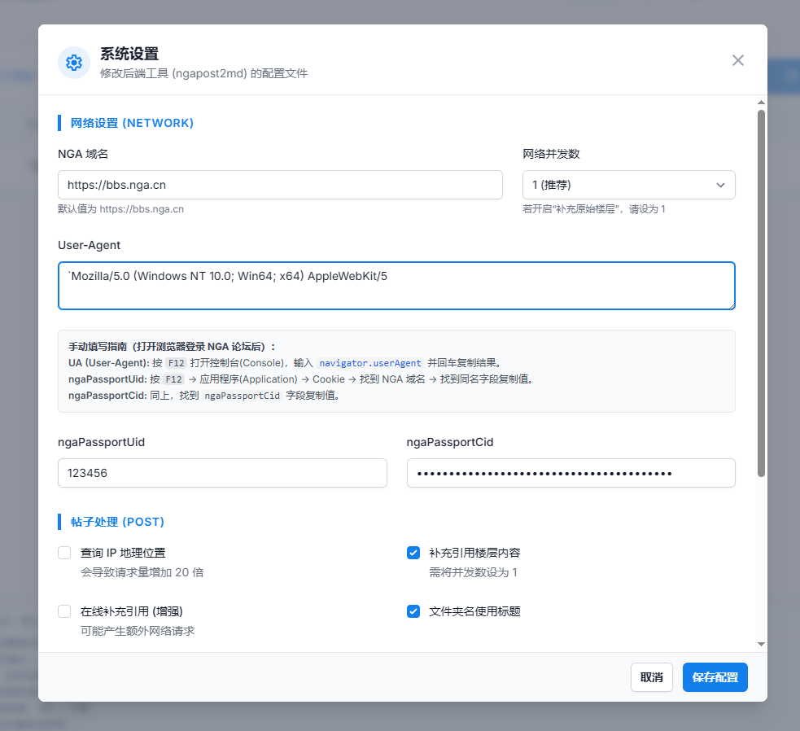
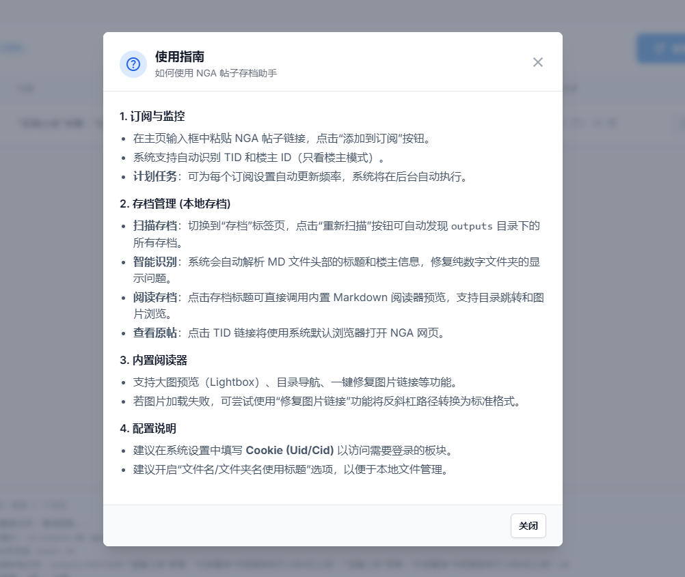

# NGA Post Saver (NGA 帖子存档助手)

NGA Post Saver 是一个基于 [Neutralinojs](https://neutralino.js.org) 构建的跨平台桌面应用，为 [ngapost2md](https://github.com/ludoux/ngapost2md) 提供了现代化的图形用户界面（GUI）。

通过本项目，您可以方便地管理 NGA 帖子订阅，自动下载帖子内容（Markdown 格式）及图片，并直接在本地进行预览和管理。

## 主要功能

*   **订阅管理**：支持添加、删除、搜索 NGA 帖子订阅。
*   **智能存档**：自动扫描本地存档，智能解析 Markdown 文件头部的标题和楼主信息，修复纯数字文件夹显示问题。
*   **自动更新**：一键更新指定帖子的最新内容，支持批量自动调度。
*   **本地预览**：内置 Markdown 阅读器，支持直接预览存档内容，包含图片灯箱浏览模式。
*   **配置界面**：图形化配置 ngapost2md 的各项参数（Cookie、并发数、图片下载等）。
*   **便捷操作**：支持直接打开原始网页、打开本地存档文件夹；启动时自动检查后端工具完整性。
*   **日志监控**：实时查看后端工具的运行日志。

## 界面截图 

添加订阅，设置自动更新计划


自动扫描本地存档


可视化配置填写


使用指南


内置md文件阅读器


## 使用指南

1.  **下载与运行**：
    *   下载最新版本的发布包。
    *   解压后运行 `ngapost2md_gui-win_x64.exe` (Windows)。
    *   **首次运行**：
        *   程序会自动创建 `outputs` 目录（如果不存在）。
        *   程序会自动检查该目录下是否存在 `ngapost2md.exe` 和 `config.ini`。如果缺失，会弹出提示框并引导您前往 GitHub Releases 页面下载。
        *   **重要**：请将下载的最新版 `ngapost2md` 压缩包解压，并将 `ngapost2md.exe` 和 `config.ini` 文件放入本程序的 `outputs` 文件夹中。

2.  **添加订阅**：
    *   在主页输入框中粘贴 NGA 帖子链接（如 `https://bbs.nga.cn/read.php?tid=123456`）。
    *   点击“添加到订阅”。

3.  **执行存档**：
    *   在订阅列表中点击“更新”按钮。
    *   等待任务完成，日志区会显示进度。

4.  **查看存档**：
    *   点击列表中的标题可直接预览。
    *   点击文件夹图标可打开本地存储目录。

## 部署与构建

### 开发环境

需要安装 [Node.js](https://nodejs.org/) 和 [Neutralinojs CLI](https://neutralino.js.org/docs/cli/overview)。

```bash
npm install -g @neutralinojs/neu
```

### 运行开发版

```bash
neu run
```

### 打包发布

```bash
neu build
```

构建完成后，生成的文件位于 `dist/` 目录下。

**注意**：本程序依赖 `ngapost2md` 可执行文件。打包发布时，请确保 `outputs/` 目录下（或系统路径中）包含 `ngapost2md.exe`，或者根据实际部署情况调整调用路径。默认配置下，程序会在 `outputs/` 目录下寻找并执行 `ngapost2md.exe`。

## 目录结构说明

*   `resources/` - 前端源码 (HTML/CSS/JS)
*   `outputs/` - 存档文件及工具输出目录
    *   `config.ini` - ngapost2md 配置文件
    *   `ngapost2md.exe` - 后端核心工具
*   `dist/` - 构建后的发布包

## 开源许可

本项目前端代码遵循 MIT 协议。后端工具 `ngapost2md` 请参考其原作者的授权协议。
